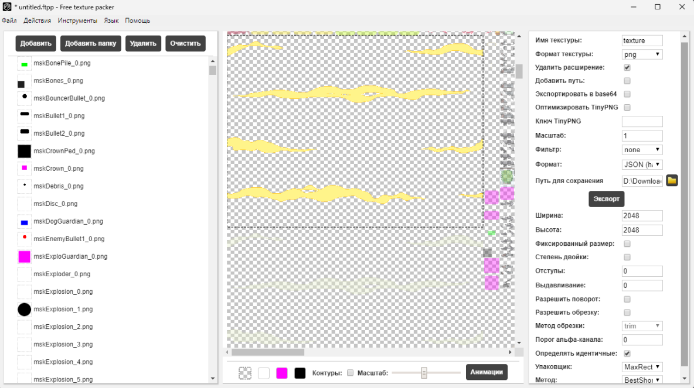

# текстуры

- Скачиваем 98 версию через [DepotDownloader](https://github.com/SteamRE/DepotDownloader/releases), при помощи команды. 
```bash
DepotDownloader.exe -app 242680 -depot 242681 -manifest 2045021080652060953 -qr
```
- Вам понадобится просканировать QR код стима, чтобы подтвердить наличия у вас лицензии.
- При помощи [UndertaleModTool](https://github.com/UnderminersTeam/UndertaleModTool/releases) открывает **data.win** 
по пути *./depots/242681/21384247*.
- У вас появится окно с *loading warning*, просто зажмите *Enter* и ждите когда они не закончатся.
- Сверху нажимает *Scripts/Resource Exporters/ExportAllSprites.csx*, выбираем папку, нажимает *No* и *No* в диалоговых окнах.
- Через [FreeTexturePacker](https://github.com/odrick/free-tex-packer/releases/tag/v0.6.7) создаем листы спрайтов, добавив папку, выставив настройки как на скриншоте нажимаем кнопку *Export*

- Запустите скрипт *NTCPP/scripts/conv_textures.py*, и в качестве аргумента введите папку с результатом работы FreeTexturePacker
```bash
python conv_textures.py /path/to/texture
```
- Готово!